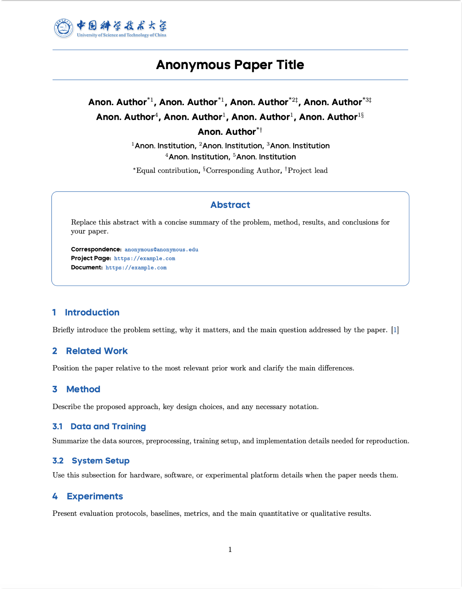

# USTC AGI LaTeX Template

A LaTeX conference paper template for USTC AGI style submissions.



## Files

- `main.tex`: paper entry file
- `ustc_conference.cls`: document class
- `sections/`: section files
- `main.bib`: bibliography file
- `assets/`: logos and preview assets
- `fonts/`: bundled font assets required by the template

## Build

Recommended:

```bash
latexmk -pdf main.tex
```

If `latexmk` is not available, use:

```bash
pdflatex main.tex
bibtex main
pdflatex main.tex
pdflatex main.tex
```

## Notes

- The repository keeps source files and required assets.
- Generated files such as `main.pdf` and LaTeX temporary files should not be committed by default.
